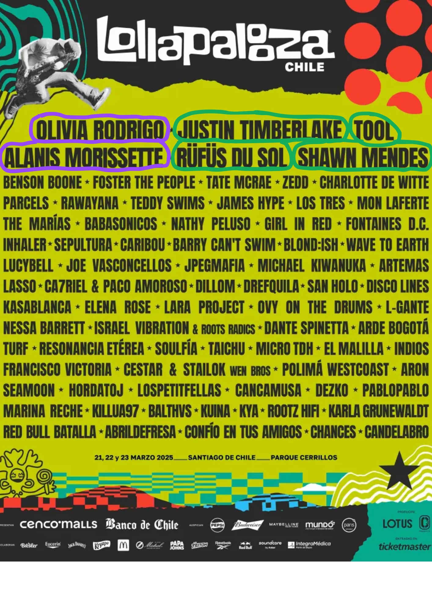
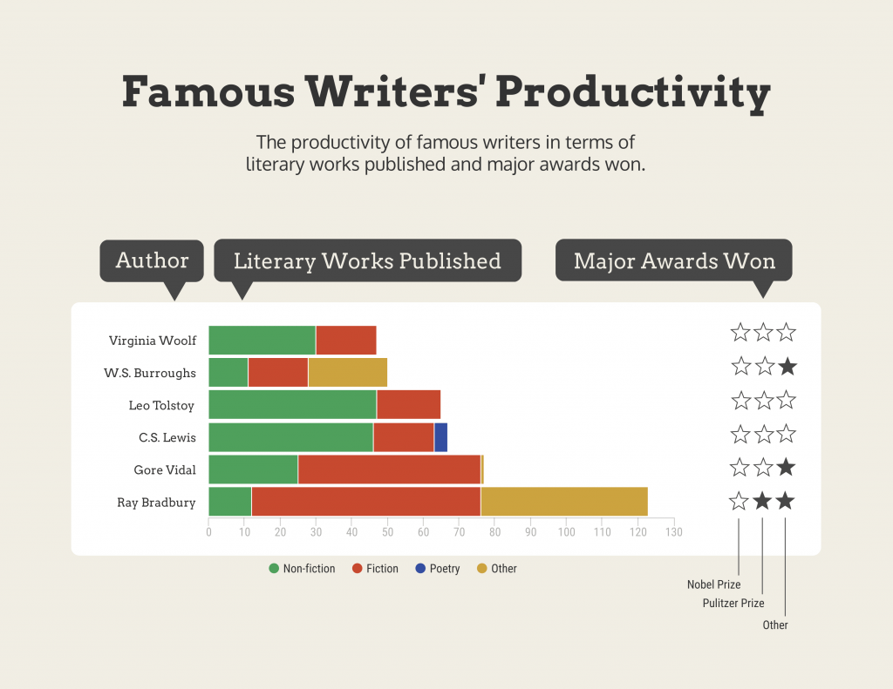

# Presentación de la propuesta #
# Brecha de Género en Lollapalooza Chile  

Desde la llegada del festival **Lollapalooza a Chile en 2011**, se ha observado una representación desigual entre artistas, hombres y mujeres en su programación. Este festival, el evento musical internacional más grande que se realiza anualmente en el país, ha sido ampliamente disfrutado sin cuestionamientos sobre la **equidad de género** en su *line up*. Nuestro proyecto busca analizar y visibilizar la brecha de género en los **últimos 15 años** del festival.  

A través del **análisis de datos** recopilados, se evidenciará que, a pesar de ser un festival moderno y global, la paridad de género sigue siendo una problemática presente. No solo se presentarán las cifras de participación femenina en comparación con la masculina, sino que también se profundizará en cómo se da esta participación, considerando factores como los horarios de presentación y la recurrencia de los artistas en el cartel del festival. Este estudio, basado en datos, permitirá una **reflexión crítica** sobre la equidad de género en la industria musical y en los eventos masivos contemporáneos.  

La brecha de género en la industria musical no es exclusiva de Lollapalooza Chile, sino que es un fenómeno extendido en los escenarios latinoamericanos. Las mujeres han tenido una menor presencia en los festivales debido a la estructura histórica de la industria. A través del análisis de los datos, se buscará no solo evidenciar la disparidad, sino también aportar a la discusión sobre cómo se puede avanzar hacia una programación más equitativa en los eventos musicales masivos.  

* **Preguntas para responder**: 

La principal pregunta que se puede responder con los datos es: 
1. ¿Existe una brecha de género en los artistas musicales en el Lollapalooza en los últimos 15 años?

Además, estas son más preguntas que podemos responder a través de los datos:

2. ¿Se ha visto una evolución en la representación de la mujer en la parrilla musical los últimos años?

3. ¿Hay disparidad de género en los artistas destacados del line up?
4. ¿Hubo un cambio en la paridad de género luego de la pandemia?
5. ¿Qué géneros musicales presentan mayor o menor paridad de género?
6. ¿Lollapalooza Chile tiene una brecha menor o mayor al resto de los países?
7. ¿Qué diferencia de género hay según el horario que se presentan los artistas (media tarde, apertura, cierre)?
8. ¿De qué género son los artistas que se han repetido en el Lollapalooza Chile?

* **Historia Visual**:

La historia que queremos contar en nuestro proyecto de investigación es que desde que llegó el Lollapalooza a Chile en 2011 , se ha observado que existe una representación desigual entre hombres y mujeres en la programación artística de Lollapalooza Chile, el cual es el festival internacional más grande que llega a nuestro país cada año. Queremos presentar una mirada crítica de un evento que se disfruta anualmente sin mayores cuestionamientos.

A través del análisis de datos recopilados queremos visibilizar en nuestra historia que la brecha de género sigue existiendo, a pesar de ser un festival moderno y global. Lo nuevo de nuestra historia es que no solo presentaremos la problemática, sino que también analizaremos las posibles causas de la poca o harta representación de la mujer a través de los años. Además, no solo mostraremos el porcentaje de la participación de la mujer en comparación del hombre, sino que profundizaremos en cómo se da esa participación. 

En relación a los elementos digitales, primero nos gustaría tener muchas fotos que complementen la información y que además hagan del sitio más entendible y bonito. Algunas de las imágenes que planeamos tener es modificar los afiches oficiales del Lollapalooza y enmarcar los nombres según su género. Este elemento ayudará a contar la brecha de género en el área músical no desde nuestra palabras, sino que ellos mismos podrán ver que existe una disparidad, el ver el nombre de los artistas encerrados en círculos ayudará a reafirmar nuestra historia de una manera rápida y fácil para el público.

Ej:

_Fuente: Lollapalooza Chile_

Otro de los elementos digitales que tendremos serán los gráficos de barra apilada por años, que representan la proporción de artistas mujeres, hombre u otro en cada edición del festival. Esto permitirá que la gente observe la magnitud de la brecha de género, y también permitirá visualizar la evolución o el estancamiento de la paridad de género a lo largo del tiempo. Así fácilmente una persona podrá sacar sus conclusiones o reflexionar por qué en un año hay mayor paridad o menos, según el contexto de ese año.

Referencia:

_Fuente:Venngage_ 

También, queremos tener un panel de control donde el usuario podrá clickear en las distintas áreas que existe una brecha de género en el festival, algunas de las áreas serían: género músical, horarios en la programación , repetición de artistas a través de los años. Y cada una de estás categorías desplegará su menú inicial con sus propios gráficos e información, aquí queremos que el gráfico sea con iconos de humanos. 

Esto ayuda a organizar la información por categorías, y así el lector evidencia que la brecha de género no solo está en la cantidad de artistas por género.

Referencia:
[Thepudding.songwriters]( https://pudding.cool/2023/07/songwriters/)

* **Resultados**:

Lo mínimo que se puede contar con los datos de los artistas de la parrilla musical de los último 15 años (desde un inicio en Chile) es mostrar que la participación de mujeres en Lollapalooza Chile ha sido considerablemente menor a la de los hombres, lo cuál refleja una brecha de género constante en la programación del festival. Además, de mostrar que los artistas más famosos de cada año, son en su mayoría hombres. Por ende, no solo sería una brecha de género en toda la parrilla musical, sino también que se da mayor visibilización a los artistas más conocidos hombres. 

Lo máximo que se puede contar es descubrir las razones de por qué se da esta brecha de género a través de los años, probablemente los datos de un año que sean más favorables con la paridad de género coinciden con temas sociales relacionados a la representación de la mujer o con políticas públicas relacionadas el tema. Además, si logramos reunir datos más profundos como los salarios, comparaciones internacionales, y lugares en las parrillas de horarios. Podremos tocar una historia más a fondo, donde el tema no solo sea la falta de representación de las artistas mujeres en el festival, sino también por qué el Lollapalooza las ubica en horarios que dan menor visibilidad, les ofrecen menores sueldos y le entregan menos oportunidades de presentarse en más de una edición del festival. También al comparar los datos con otros países de latinoamérica o Estados Unidos, se puede revelar si es un problema en Chile o global, o se puede evidenciar que tan atrasados estamos en la representación de género, en relación con su creador del festival, Estados Unidos.

