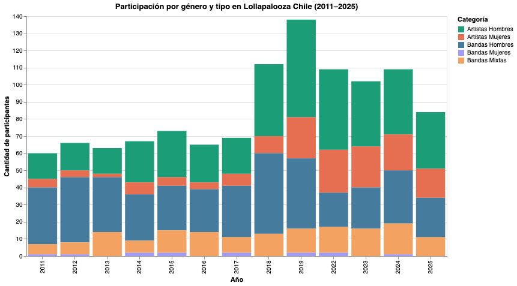

# Una brecha de género que persiste: la participación femenina en el Lollapalooza a tráves de los años

El Lollapalooza es uno de los festivales de música más grande, es de origen estadounidense y llegó a Chile en 2011 para quedarse, al principio fueron dos días enteros de diversión, pero como se puede apreciar en el gráfico en 2018 suben exponencialmente el número de artistas, ya que a partir de ese año fueron tres días de festival. 

Este evento entrega una amplia parrilla de artistas nacionales e internacionales, distribuidos por horario y días. Sin embargo, a pesar de tener una diversidad aparente, podemos observar una desigualdad que se produce año tras año: la brecha de género en la participación de artistas.

Como sociedad, cada vez más nos preocupamos por tener paridad de género y tener una amplia representación, pero esto no lo podemos apreciar en la diversidad de artistas que entregan este festival. Se puede visualizar cómo a través de los años siempre el hombre tiene mayor representación y la mujer nunca llega siquiera a acercarse en cantidad. Aunque las solistas mujeres han tenido mayor participación desde que el festival dura tres días sigue sin poder igualarse a la cantidad de hombres, incluso en ediciones con mayor cantidad total de artistas como el 2019 , la proporción de mujeres no mejora proporcionalmente. Esta tendencia sugiere que el Lollapalooza no está acompañado por una política de equidad en la representación de género, ni ha hecho un esfuerzo significativo.

Con respecto a la composición de las bandas hay varios fenómenos llamativos. Por un lado, en muchas ediciones la mayor cantidad de participación lo obtienen las bandas conformadas por hombres, superando a los solistas de su propio género. Esto además, al ser bandas conformadas a veces hasta por más de cinco integrantes acrecienta la brecha de género. Por otro lado, las bandas solamente de mujeres son muy escasas y en cinco ocasiones no hubo ninguna. Pareciera que en los últimos años las bandas mixtas fueran una señal de avance, pero tampoco han mostrado un crecimiento constante ni exponencial, manteniéndose con participación baja en comparación con las bandas masculinas. Además, un punto a considerar es que una gran parte de las bandas mixtas son parte del kidzapalooza, y son agrupaciones musicales infantiles, que muchas veces llevan trajes que no permiten identificar su género. Esto produce que a nivel macro pareciera que hay un avance con las bandas mixtas, pero en realidad están contempladas en otros escenarios distintos a los principales. 

Este fenómeno plantea interrogantes importantes: ¿quién deciden los line-up?, ¿qué criterios se utilizan?, ¿cuánta preocupación hay en entregar una parrilla con diversidad de género a la hora de programar?. Detrás de cada barra en el gráfico hay decisiones que se tomaron y oportunidades que faltan por entregar, de forma consciente o inconsciente esto perpetúa un modelo cultural que sigue priorizando ciertos artistas por sobre otros. 