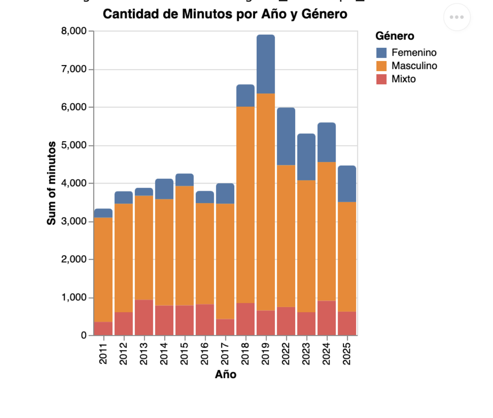

# Una brecha de género que persiste: El tiempo en escenario es empoderado por los hombres en el festival Lollapalooza

En Chile, el festival que ha dejado precedente dentro de la música chilena es el Lollapalooza. Desde su llegada en 2011, ha tenido un gran incremento de popularidad entre los jóvenes, a tal punto que el mismo evento ha aumentado el número de artistas, escenarios y de días.

Este evento busca dar una experiencia única para los asistentes, lo que ha generado que se convierta en un gran paso para los artistas, siendo que Lollapalooza es el lugar donde se consolidan. Esto ha sucedido con artistas como Polimá Westcoast en 2019, que desde ese punto dejó marca en el trap nacional.

Al ser un evento de tal trascendencia, las oportunidades que se dan son tan importantes como eso, y ahí se presenta un gran peligro: la brecha de género. La desigualdad de oportunidades entre hombres y mujeres es algo que ha ocurrido como sociedad desde la época de la colonización, momento donde la mujer no tenía derecho a voto. Hoy en día, ese margen de poder se ha transformado en cosas como los minutos que se dan a las mujeres y a los hombres en festivales como Lollapalooza.

La tendencia de que las mujeres reciban una pequeña parte de los minutos del evento es algo que se ha presentado desde 2011 hasta la actualidad, nunca llegando al 25 % de los minutos en escenario. En años como 2019 y 2022 se ha presenciado más participación de la cuota femenina, pero en proporción no se han igualado las oportunidades para las mujeres.

Esta realidad abre preguntas clave: ¿quiénes están a cargo de definir el line-up?, ¿qué factores influyen realmente en esa selección?, ¿existe una intención concreta de fomentar la equidad de género? Cada número, cada gráfico y cada ausencia revelan decisiones que moldean el panorama musical. Ya sea por omisión o por falta de voluntad, se reproduce un patrón que continúa privilegiando ciertas voces y silenciando otras, manteniendo una desigualdad que el tiempo aún no ha logrado corregir.